# 🍽 Tapas Me The Plate – Temas WordPress (Padre e Hijo)

Este repositorio contiene el tema **padre** y el tema **hijo** desarrollados para el sitio web “Tapas Me The Plate”, un proyecto de catering y alta cocina.

## 📂 Estructura del repositorio
- **`tapas-theme/`** → Tema padre con plantillas personalizadas para páginas y contenido.
- **`tapas-child/`** → Tema hijo que sobrescribe plantillas de WooCommerce y añade estilos específicos.

Cada carpeta contiene su propio `README.md` con:
- Descripción del tema
- Requisitos
- Instalación
- Notas y licencia

## 🚀 Instalación
1. Copiar las carpetas `tapas-theme/` y `tapas-child/` dentro de `wp-content/themes/` de tu instalación WordPress.
2. Activar el tema hijo **Tapas Child** en el panel de WordPress (el padre se usará automáticamente).
3. Asegurarse de tener **WooCommerce** activo para aplicar las personalizaciones de tienda y área de cuenta.

## 📑 Secciones de la página

El sitio “Tapas Me The Plate” cuenta con las siguientes secciones principales:

- **Home (Inicio)** → portada con hero dinámico (CPT Banners), presentación de servicios, menús destacados, blog y vídeo corporativo.
- **Menú (Menu)** → listado de platos organizados con imágenes destacadas, paginación y detalles de cada entrada (CPT `menu`).
- **Servicios (Our Services)** → muestra los servicios de catering y alta cocina ofrecidos.
- **Sobre nosotros (About Us)** → sección corporativa con la filosofía y esencia mediterránea del catering.
- **Blog** → publicaciones y artículos de actualidad gastronómica.
- **Contacto (Contact Us)** → formulario de contacto para clientes.
- **Reseñas (Reviews)** → testimonios de clientes gestionados mediante el CPT `reviews`.
- **Reservas (Booking)**  
  - **Reserva nueva**: formulario en varios pasos (`page-booking.php`) con validación de fecha, hora y comensales.  
  - **Modificar reserva**: formulario (`page-modify-booking.php`) que permite a los usuarios cambiar su reserva ya existente.  
  - Los datos se almacenan en tabla personalizada `wp_reservas_reservas` y en el CPT `reservas`.

### 🔐 Área privada
El tema (junto al hijo) integra un sistema de **área privada** conectado a WooCommerce:

- **Login / Registro** → página personalizada para acceder o crear una cuenta.  
- **Dashboard del cliente (My Account)** → accesible solo para usuarios registrados. Incluye:  
  - Datos personales y direcciones (WooCommerce).  
  - Historial de pedidos (WooCommerce).  
  - **Historial de reservas**: listado de reservas asociadas al usuario (`wp_reservas_reservas`), visible desde un endpoint personalizado en el tema hijo.  
- **Gestión de reservas** → desde esta sección, el cliente puede:
  - Consultar reservas activas.  
  - Modificar datos de la reserva (fecha, hora, número de comensales, ubicación).  
  - Cancelar reservas si lo desea.  

De esta manera, la **área privada** no solo cubre compras de la tienda online, sino también el control y la gestión de reservas de catering.

## 🖼 Capturas de pantalla

### Página principal

### Secciones del sitio
- **Servicios**  
  [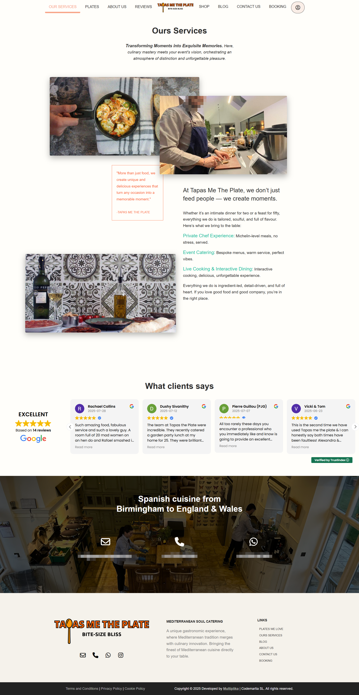](screenshots/ourservices.png)

- **Platos**  
  [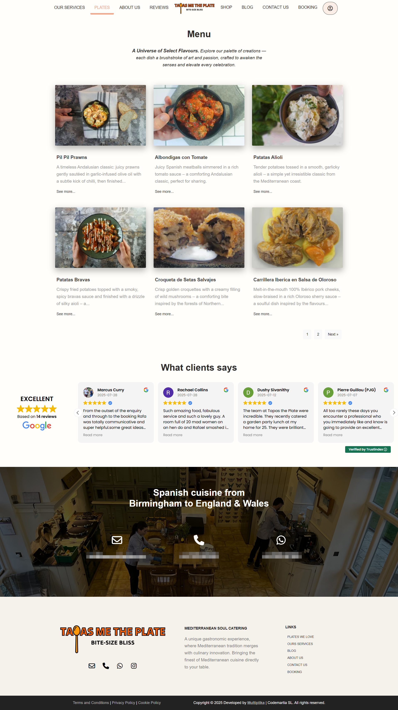](screenshots/plates.png)

- **Blog**  
  [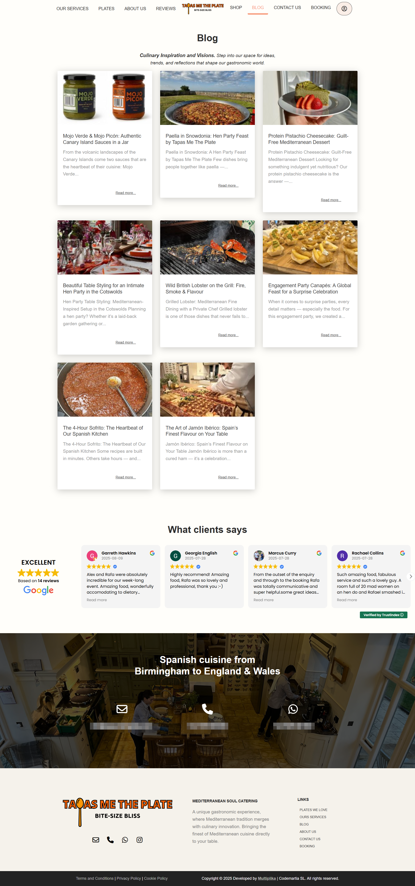](screenshots/blog.png)

- **Contacto**  
  [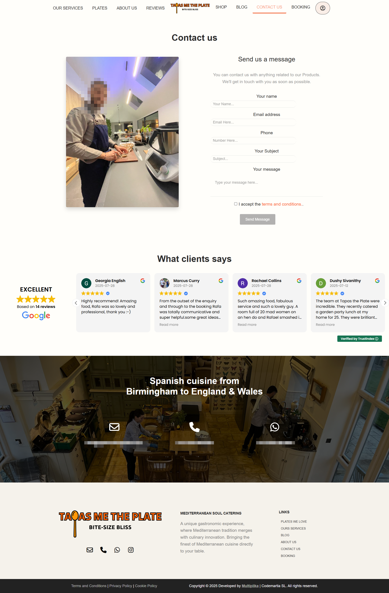](screenshots/contact-us.png)

### Reservas
- **Calendario**  
  [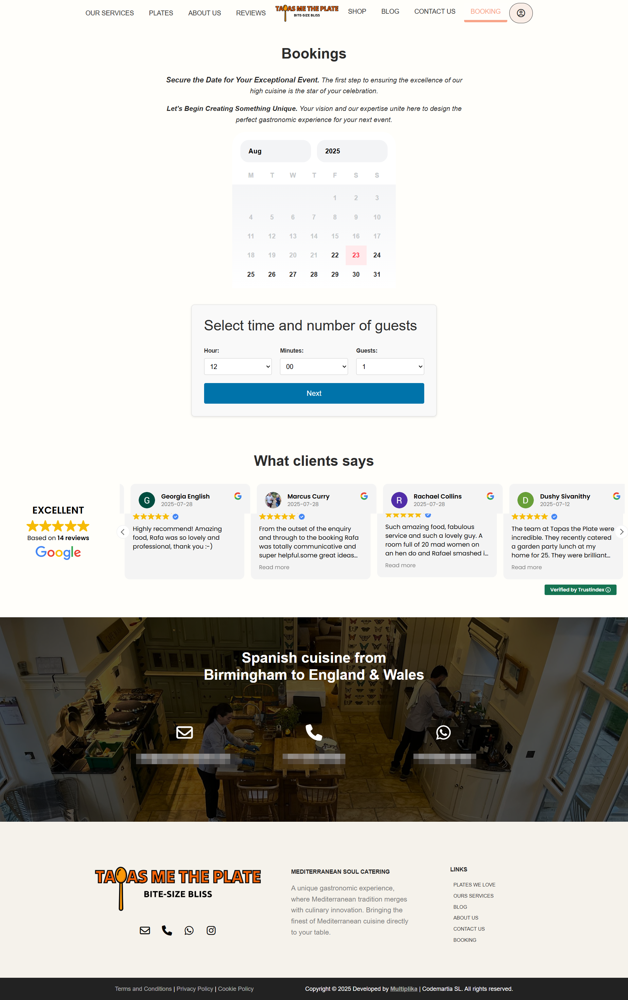](screenshots/booking.png)

- **Datos personales**  
  [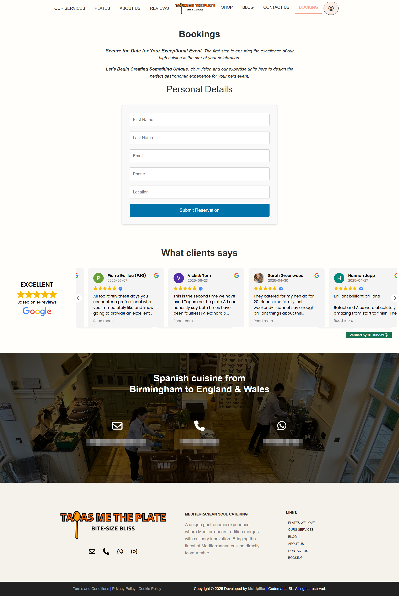](screenshots/booking-personalData.png)

- **Gestión de reservas**  
  [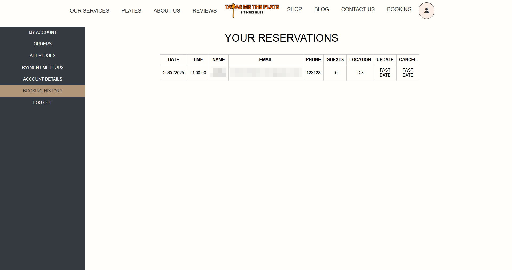](screenshots/Gestion-reservas.png)

### Tienda
- **Página de tienda**  
  [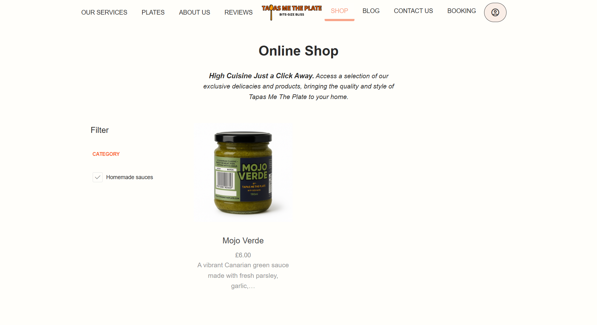](screenshots/shop.png)

- **Listado de productos**  
  [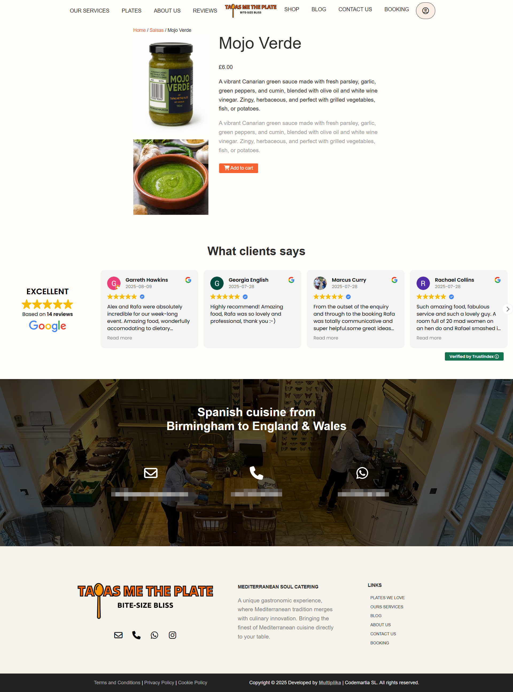](screenshots/shop-products.png)

### Área privada
- **Login**  
  [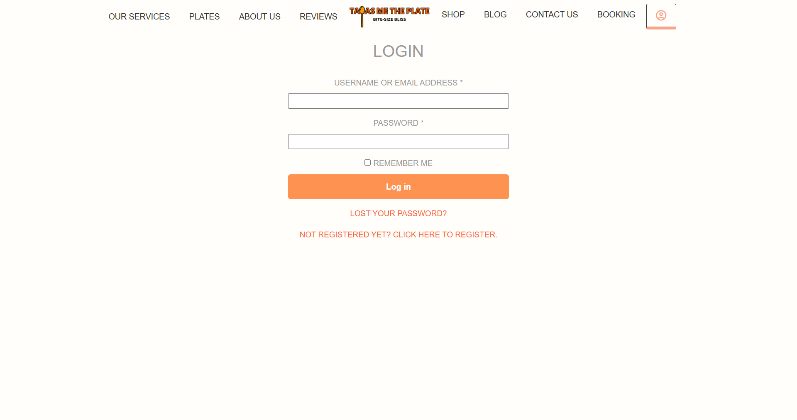](screenshots/login.png)

- **Área privada**  
  [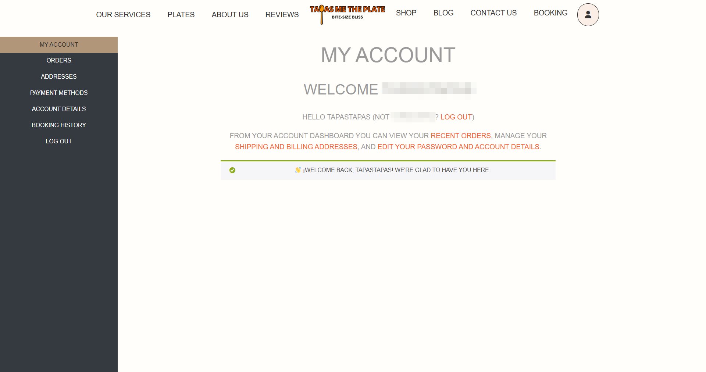](screenshots/private-area.png)

## 🧾 Licencia
Este repositorio está bajo la **[Licencia MIT](LICENSE)**.  

> 📌 Se incluye además una traducción al español en `LICENSE.es.md` únicamente con fines informativos.  

